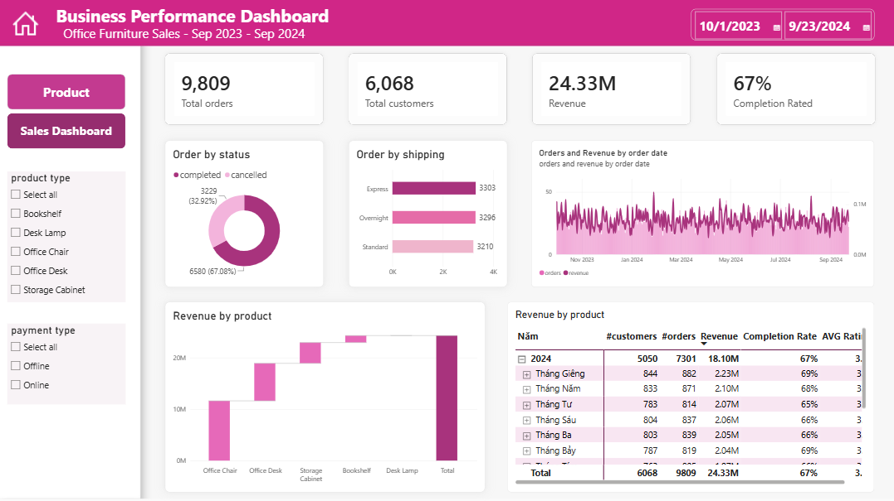

# Power BI Data Analysis Portfolio

Hi, I am Luong Minh Khanh An, a final-year Information Technology student
with hands-on experience in SQL, Python-based data processing, relational
databases, and Power BI dashboard development.

This repository contains two Power BI projects focused on dashboard
development, data preparation, data validation, and business-oriented analysis.

---

## 1. Office Furniture Sales Performance Dashboard

### Overview

An interactive Power BI dashboard for analyzing sales and order performance
across time and multiple business dimensions.

### Dataset

- 9,809 orders
- 6,068 customers
- 12-month period: September 2023 to September 2024
- Sample sales dataset

### Tools

- Power BI
- DAX

### Analysis

- Revenue
- Order completion rate
- Average customer rating
- Product type
- Shipping method
- Payment type
- Monthly performance

### Dashboard Preview

### Limitations

This project uses a sample dataset and does not represent actual company
performance or real business targets.

---

## 2. Vietnam Socio-Economic Dashboard

### Overview

An interactive Power BI dashboard analyzing socio-economic indicators across
34 provinces after the administrative merger.

### Data

- GDP: $484B
- Population: 114M
- Area
- Population density
- Income per capita
- 34 provinces
- 3 macro-regions
- 6 sub-regions

### Tools

- Power BI
- Power Query
- DAX

### Data Preparation and Quality Checks

- Mapped provincial entities across two independent sources.
- Standardized inconsistent locality names.
- Compared keys and record counts.
- Resolved mismatches before combining the datasets.
- Created a single analytical model for reporting.

### Analysis

- Compared GDP and income across macro-regions and sub-regions.
- Created maps and drill-down views.
- Identified Dong Nam Bo as the top GDP-contributing sub-region in the dashboard.

### Dashboard Preview

### Limitations

The analysis depends on the definitions, coverage, update timing, and quality
of the two source datasets.

---

## Skills Demonstrated

- Power BI dashboard development
- DAX measures
- Power Query transformations
- SQL and relational database concepts
- Python/pandas data processing
- Data preparation and validation
- Entity mapping
- Cross-source data reconciliation
- Business-oriented reporting

## Contact

- GitHub: https://github.com/khanhan0603
- Email: lmkhanhan@gmail.com
